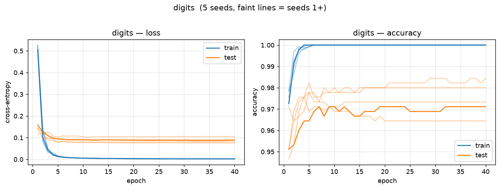

# Neural Networks from Scratch

A scalar reverse-mode autograd engine written in pure Python, and the neural
networks built on top of it — no PyTorch, no TensorFlow, no NumPy in the
forward or backward pass.

Every number in a network is a `Value`: a single Python float that remembers
which operation produced it and which operands it came from. Composing them
builds a computation graph dynamically, and one reverse pass over that graph
produces every gradient.

```python
from dlscratch import Value

a, b = Value(2.0), Value(-3.0)
c = (a * b + 10.0).tanh()
c.backward()
a.grad, b.grad          # (-0.004022..., 0.002681...)
```

The gradients are checked against `torch.autograd` to within `1e-9` — see
[`tests/test_engine.py`](tests/test_engine.py).

---

## Results

Four scikit-learn datasets, trained end to end on the scratch engine with
minibatch SGD + momentum and softmax cross-entropy. Accuracy is the
**final-epoch** test accuracy, mean ± std over **5 seeds**; each seed also
reshuffles the stratified 75/25 split, so the spread reflects split variance
as well as initialization.

There are also two baselines columns that are scikit-learn's own classifiers trained on *identical* splits.

| Dataset | Samples | Features | Classes | Architecture | Params | Test accuracy | sklearn MLP | Logistic reg. | s/epoch |
|---|---|---|---|---|---|---|---|---|---|
| `iris` | 150 | 4 | 3 | 4-8-3 | 67 | **98.4 ± 2.4** | 97.4 ± 2.6 | 95.8 ± 4.0 | 0.03 |
| `wine` | 178 | 13 | 3 | 13-16-3 | 275 | **98.2 ± 1.0** | 97.8 ± 1.6 | 98.7 ± 1.2 | 0.09 |
| `breast_cancer` | 569 | 30 | 2 | 30-16-2 | 530 | **97.2 ± 1.3** | 97.1 ± 0.9 | 97.1 ± 1.0 | 0.29 |
| `digits` | 1797 | 64 | 10 | 64-64-10 | 4810 | **97.5 ± 0.8** | 97.3 ± 0.8 | 96.9 ± 1.3 | 5.04 |

Training curves for every dataset are in [`results/`](results/), alongside the
raw JSON each number was read from.

<p align="center">
  
</p>

---

## Repository layout

```
dlscratch/
  engine.py     Value: the scalar autograd engine (+ the fused `dot` op)
  nn.py         Neuron / Layer / MLP, Xavier + He initialization
  losses.py     softmax cross-entropy (stable log-sum-exp), MSE, tree_sum
  optim.py      SGD with momentum and weight decay
  data.py       dataset loading, stratified splits, train-fit standardization
  metrics.py    accuracy, confusion matrix
  trainer.py    minibatch training loop
  viz.py        draw_dot -- optional graphviz rendering of a graph
experiments/
  config.py     the hyperparameters behind the results table
  run.py        train one dataset
  run_all.py    all datasets x 5 seeds -> results/*.json, plots, table.md
benchmarks/
  bench_backward.py   notebook engine vs this one
tests/
  test_engine.py      gradients vs torch.autograd and finite differences
results/              generated JSON, plots and the results table
autograd.ipynb        the original exploratory notebook
```

## Usage

```bash
pip install -r requirements.txt

python tests/test_engine.py                    # or: python -m pytest tests/ -q
python benchmarks/bench_backward.py
python experiments/run.py --dataset digits     # one dataset, verbose
python experiments/run_all.py                  # everything, regenerates results/
```

`run.py` takes overrides for anything in `experiments/config.py`:

```bash
python experiments/run.py --dataset iris --hidden 16 8 --act relu --epochs 100 --lr 0.05
```

Training a model directly:

```python
import dlscratch as dl

data  = dl.load("digits", seed=0)
model = dl.MLP([data.n_features, 64, data.n_classes], hidden_act="tanh", seed=0)
hist  = dl.train(model, data, epochs=40, lr=0.1, batch_size=32, momentum=0.9)

print(hist["final_test_acc"])
print(dl.format_confusion_matrix(hist["confusion_matrix"], data.class_names))
```

## What the engine supports

`+ - * / **` (float exponents), unary negation and the reflected forms, plus
`tanh`, `relu`, `exp`, `log`, and the fused `dot`. That is enough for an MLP
with softmax cross-entropy. Gradients accumulate on shared nodes, so a value
reused along several paths gets the sum of its contributions.

## Limitations

**The engine is scalar.** Every intermediate number is a separate Python object
holding a closure, so a weighted sum over 64 inputs allocates as many objects as
it does multiplications. Fusing the whole weighted sum into a single `dot` node
hides the worst of it, but the cost is still per-scalar: on a `[64, 64, 10]` net
at batch 32, one step takes **97 ms here vs 0.44 ms in PyTorch — ~220× slower**,
and the gap widens with batch size, where vectorization is exactly what pays off.

**Which is why MNIST is out of reach.** A `[784, 64, 10]` network over 60,000
samples is **~478× the work of `digits` per epoch**; at the measured 5.0 s/epoch
that is roughly **40 minutes per epoch**, or over half a day for a normal run.
No amount of tuning the scalar engine fixes this — the arithmetic is not the
bottleneck, Python object overhead is. It needs a different design: array-valued
nodes (a `Tensor` wrapping a NumPy array, with matmul as one op), so cost scales
with *layers* rather than with individual multiplications. `digits` is the honest
ceiling here, and it is the same task — 10-class handwritten digit recognition,
at 8×8 instead of 28×28.

Also missing: convolutions, dropout, batch norm, and any learning-rate schedule
beyond a fixed decay. `train()` tracks the best test accuracy for diagnostics,
but reported numbers are final-epoch — selecting the best epoch would be tuning
on the test set.

## Credit

The `Value` engine follows the design of Andrej Karpathy's
[micrograd](https://github.com/karpathy/micrograd); everything here was written
from scratch against that idea.
